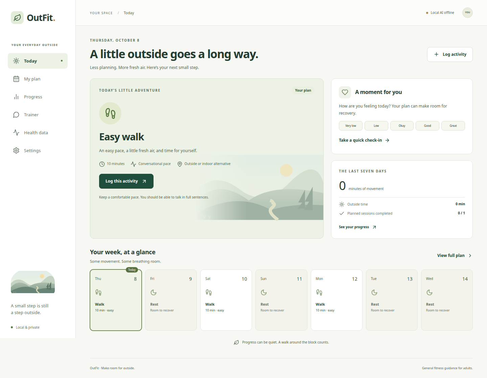

# OutFit

A little movement. A little more outside.

OutFit is a responsive, local fitness-planning prototype for the **Touch Grass** hackathon. It helps an adult choose a realistic goal, preview and accept a seven-day plan, record activity and recovery, and review an adjustment. Local Ollama selects activities within deterministic policy limits. A validated fallback keeps the core loop working without a model.



## Run locally

Use **Node 24 LTS** and npm. From this repository:

```bash
npm ci
cp .env.example .env
npm run build
npm start
```

Open **http://127.0.0.1:3001** on the same computer. The server creates and migrates `data/outfit.db` automatically. `.env` loads at startup; existing environment variables take precedence. Stop with Ctrl+C. Restarting preserves saved profiles, logs, check-ins, and plans.

For development:

```bash
npm run dev
```

Open **http://127.0.0.1:5173**. Vite proxies `/api` to the loopback Fastify server. Both scripts run from the repository root. Development explicitly permits the Vite origin; the production preview permits only the configured app origin.

In the current coding session, Node was downloaded into `/tmp`, rather than installed system-wide. If your terminal still says `node: command not found`, use this temporary runtime before the commands above:

```bash
export PATH=/tmp/node-v24.21.0-linux-x64/bin:$PATH
```

That directory is temporary. Install Node 24 normally for continued development after a reboot.

## Connect local AI

Start Ollama separately. Install a model appropriate for your hardware and its license, then select the installed tag in **Settings**, or set `OLLAMA_MODEL` in `.env`. OutFit does not download models, choose a model on your behalf, or call a cloud provider.

Only the API server calls the configured Ollama origin (default `http://127.0.0.1:11434`). The server validates the model against `/api/tags`, calls `/api/chat` with a Zod-generated JSON Schema, `stream:false`, and temperature 0, and parses the complete `message.content`. There is at most one repair, a 90-second deadline, and independent checks for dates, catalog content, budgets, availability, recovery, and immutable history. It discovers thinking controls with `/api/show` and disables thinking when the model advertises support for `false`. Older Ollama versions without thinking metadata use the documented Qwen3.8 control only when that installed model advertises thinking capability; other models retain their defaults. Model discovery allows up to ten seconds, bounded by the configured timeout. Failed, absent, truncated, unsafe, or unavailable responses produce a labelled fallback preview.

AI explanation text is not displayed in this prototype. All explanations and activity instructions come from fixed application text, avoiding health assurances or conflicting prescriptions in model prose.

To verify one real model against synthetic beginner fixtures without changing your database:

```bash
OLLAMA_MODEL=your-installed-tag npm run smoke:ollama
```

A successful result records the Node/Ollama versions, tag/digest, duration and validation outcome. Fallback returns a failing exit code for this particular check; it is not reported as real-inference success.

**Real Ollama generation has not been tested:** no service was listening on port 11434 during verification. No model/version/digest or inference duration is claimed. See [verification](docs/verification.md) for the precise outstanding check. The fake-provider and fallback checks require no GPU or model download.

## Try the core loop

1. Complete onboarding: confirm adult use, timezone, goal, days, limits, recent activity, and safety screen. Each Continue saves valid profile progress locally; the goal saves when onboarding finishes. Unknown baseline is allowed. Restarting unfinished onboarding retains saved profile fields and starts at the first step.
2. Open **My plan**, choose a start date, and create a preview. Review all seven days, training minutes, rest, instructions, and the source badge. Accept explicitly. Current-week changes use Adjust this week; a new week starts after the current plan ends.
3. Open **Today**. Select a date in the week strip. Log a session using the planned-duration shortcut, or record unplanned activity. Actual duration is an observation; it may exceed prescribed limits. Rest days do not need completion logs.
4. Save a recovery check-in. To demonstrate a reduction, record energy 2 and sleep 5 hours. Open **My plan → Adjust this week**. Review the changes, then accept or discard.
5. **Progress** shows the last seven calendar days and the complete activity history. Partial sessions contribute actual minutes without counting as completed planned sessions. Missing logs, skips, rest, future sessions, unknown recovery, and unknown effort remain distinct.
6. **Settings** supports profile edits, installed-model selection, JSON export, and confirmed deletion. Symptom flags pause prescriptions immediately; they remain blocked through observation edits/deletion until explicit re-screening. Logging, history, and export remain accessible.

The deterministic limits are conservative product decisions from the supplied spec, not clinically validated guarantees. The catalog needs professional review before broader use. OutFit does not assess medical fitness or provide diagnosis, rehabilitation, race performance, or weight-loss prescriptions.

## Configuration

| Variable              | Default                       | Purpose                                                   |
| --------------------- | ----------------------------- | --------------------------------------------------------- |
| `APP_HOST`            | `127.0.0.1`                   | Loopback binding                                          |
| `APP_PORT`            | `3001`                        | App/API port                                              |
| `DATABASE_PATH`       | `./data/outfit.db`            | Local SQLite file                                         |
| `OLLAMA_BASE_URL`     | `http://127.0.0.1:11434`      | Configured HTTP(S) origin                                 |
| `OLLAMA_ALLOW_REMOTE` | `false`                       | Opt in to a trusted remote Ollama server                  |
| `OLLAMA_MODEL`        | empty                         | Installed tag, also selectable in Settings                |
| `OLLAMA_TIMEOUT_MS`   | `60000`                       | Attempt timeout, bounded by total deadline                |
| `APP_ORIGIN`          | origin derived from host/port | Host/Origin allowlist                                     |
| `APP_ACCESS_TOKEN`    | unset                         | Required for non-loopback binding; at least 32 characters |
| `APP_DEV_ORIGIN`      | unset                         | Explicit development proxy origin; set by `npm run dev`   |

An empty model is an intentional prototype substitution for a required startup model: it allows immediate fallback demos, and an installed model can be chosen later in Settings. Non-loopback Ollama URLs require `OLLAMA_ALLOW_REMOTE=true`. For your tailnet server, set `OLLAMA_BASE_URL=http://ollama-server.example.ts.net:11434` and enable that flag. The app server must have Tailscale connectivity and name resolution. Only this configured origin is used; browser requests cannot choose inference URLs, and redirects are rejected. This is an authorized extension of the original same-computer MVP. Activity snapshots are sent to your configured machine; raw notes remain excluded.

Same-computer use is the supported runtime. For an optional phone demo, use a trusted private network or an authenticated secure tunnel. Configure `APP_HOST`, the exact browser-facing `APP_ORIGIN`, and a strong `APP_ACCESS_TOKEN` before exposing the app. The browser prompts for the token, holds it in sessionStorage, and sends it as a Bearer token. Protect the transport with HTTPS when crossing an untrusted network. Never expose Ollama itself. No standalone phone inference, service worker, or offline phone caching is provided.

## Data and privacy

The SQLite database is **not automatically encrypted**. Use OS disk encryption and handle backups responsibly. SQLite WAL files beside the database also contain data. To back up, stop the app and copy the database and companion files, or use the in-app JSON export. Export includes version, timestamp, profile, goals, plans, frozen plan-history dates, logs, and check-ins; import is outside the prototype.

Deletion requires typing `DELETE_MY_DATA`, removes application records and invalidates running jobs, and retains migrations/configuration. Downloaded exports and backups remain under your control. The app sends no analytics and loads no third-party fonts or scripts. Ordinary diagnostics do not log health observations, notes, model text, or prompts. Initial dependency/model downloads require internet; normal operation after setup uses local resources.

## Architecture

```text
React / Vite browser
    │ same-origin /api/v1
Fastify server ── SQLite
    ├── strict Zod request contracts
    ├── aggregate revisions / idempotency / atomic acceptance
    ├── pure deterministic policy + immutable activity catalog
    └── local Ollama structured proposals → validator → draft
```

- `apps/web/src`: responsive screens, accessible forms/dialogs, API client.
- `apps/api/src`: validated routes, persistence, generation jobs, local AI, gated fixture adapter.
- `apps/api/migrations`: ordered SQL migrations tracked in SQLite.
- `packages/domain/src`: strict domain schemas, approved catalog, date helpers, policy, planning, metrics.
- `tests/fixtures`: fake profile, plan, log and recovery builders; no real personal data.
- `tests/e2e`: browser core-loop, fallback/safety, keyboard and accessibility checks.

**Prototype guard:** full regeneration cannot overlap the current accepted week. Use adaptation for that period, so regeneration cannot bypass midweek reduction rules. A later new week intentionally replaces the current plan when accepted.

**Persistence substitution:** Node's built-in `node:sqlite` driver and explicit SQL replace Drizzle in this prototype, avoiding native addon setup. Named tables, foreign keys, unique constraints, normalized session memberships, immutable session links, and transactions are retained. Versioned entity metadata is stored in JSON columns. The HTTP API follows the supplied contract and adds read-only `/catalog` and `today`/safety-flag state fields for the UI.

Jobs snapshot inputs before inference, persist status, recover interrupted jobs as `SERVER_RESTARTED`, and reject stale completion/acceptance. Log and job creation require UUID idempotency keys retained for 24 hours. Plan acceptance uses a transaction and a unique accepted-plan constraint. Adaptation changes only unlogged future sessions; previously accepted history and log links survive regeneration.

The development fixture adapter validates normalized observations and demonstrates deduplication, updates and tombstones. It is disabled by default, is gated by `FIXTURE_ADAPTER_ENABLED=true` outside production, and has no HTTP import endpoint. Real Health Connect, HealthKit, Strava and Garmin integrations remain unavailable.

## Test and inspect

```bash
npm run typecheck
npm run lint
npm test
npm run build
npx playwright install chromium
npm run test:e2e
```

On a Linux host missing browser libraries, install Playwright's documented browser dependencies first. E2E uses isolated `/tmp/outfit-e2e-desktop.db` and `/tmp/outfit-e2e-mobile.db` databases, one worker, a built frontend, and an unavailable Ollama test port; it does not touch the default app database. E2E uses ports 4301 and 4302, leaving the regular preview on port 3001 untouched. Each viewport has its own server so the rate limit remains enabled. In this session, test browsers were placed in `/tmp/outfit-browsers`; set `PLAYWRIGHT_BROWSERS_PATH=/tmp/outfit-browsers` to reuse them.

`npm run check` groups typecheck, lint, domain/API tests and build. `npm run format` formats source and docs. [Verification evidence and remaining limitations](docs/verification.md) map back to the supplied [MVP specification](docs/mvp-spec.md). The prototype is not presented as a fully verified MVP until the real-model and human usability checks are completed.

### Verified AI setup

Real inference passed on October 8, 2026 with Ollama `0.32.13`, `qwen3.8:27b` (digest `22130167c4c20e20c7b71454612966ca8e8171e9b3cc8ab6ce8aa6cbfec79643`): seven validated days in 47,255 ms using synthetic fixtures. Existing fallback drafts are not automatically regenerated. Discard a pending fallback draft and generate again; use adaptation for an already accepted week. Private server details stay in ignored `.env` files.

### Trainer, measurements and health data

- **Trainer:** chat about habits and your saved plan using the selected AI model. Chats are temporary and do not alter accepted plans. Body measurements and raw log notes are excluded from automatic context.
- **Settings:** optional height/weight with metric or imperial entry; canonical metric storage and JSON export.
- **Health data:** validated normalized JSON imports and a source-labelled activity timeline with update/deduplication/deletion handling. Imports remain separate from manually logged progress to avoid double counting. Live Strava/HealthKit/Health Connect/Garmin sync is not implemented.

See [connection design and limitations](docs/health-integrations.md) for the web OAuth and native phone integration paths.

## Public release and GitHub Pages

Run `npm run check:public` before publishing. Private env copies, databases, exports, credentials and machine settings are ignored; CI also checks source/history and generated assets. No scanner guarantees that arbitrary text/images are free of PII. Commit identity and license still deserve review.

The **browser edition** runs without an OutFit server: `npm run build:pages` then `npm run preview:pages`. It stores data in the browser and calls the user's Ollama directly, defaulting to `http://127.0.0.1:11434`. Settings supports a trusted custom endpoint. The existing Node/SQLite server mode remains available.

A GitHub Actions workflow builds/deploys only static assets on pushes to `main`, or when started manually. Ollama must allow the exact Pages origin and the browser may require local-network permission. See [release audit, Pages setup and browser privacy limits](docs/public-release.md).

The Pages root opens OutFit. A separate `help.html` page renders the user guide, health integration notes, deployment instructions and MVP specification. Help links are available before onboarding and in the app footer; documentation works without a profile or AI connection.
